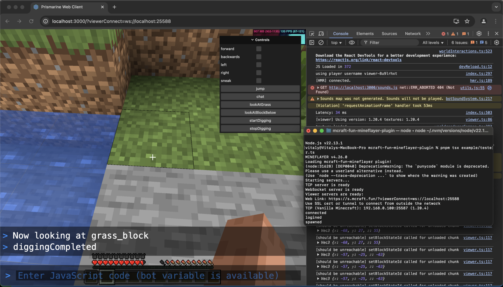

# Mineflayer Web Viewer



Viewer for Vanilla clients & [mcraft.fun](https://mcraft.fun) ([repo](https://github.com/zardoy/minecraft-web-client)) project.

## Features

- Full & extended supported for the web client
- Vanilla Minecraft clients support (tcp server is enabled by default)
- Interactive UI controls (web client only)
- Console output viewing & REPL (web client only)

## Usage Example

> Note: there are known visual issues on 1.21.4

```ts
import { createBot } from 'mineflayer'
import { viewerConnector, onReady } from 'mcraft-fun-mineflayer'

const bot = createBot({
    host: 'your-server',
    username: 'test',
})

bot.loadPlugin(viewerConnector({
    // Enable console output viewing
    sendConsole: true,
    // Optional IP whitelist
    // ipFilter: ['127.0.0.1'],
    // Optionally enable remote JS code exection (use only with ip filter or password!)
    // allowEval: true,
    // forwardChat: true,

    // Optionally disable connection instructions
    // showConnectionInstructions: false,
}))

// Add UI elements when plugin is ready
onReady(bot).then(() => {
    // Display bot state
    bot.webViewer.ui.updateUI('status', {
        type: 'text',
        x: 10,
        y: 10,
        text: 'Waiting for new objective...', // pixelart icons are supported eg {icon:eye}
    })

    // Add interactive controls
    bot.webViewer.ui.updateLil('controls', {
        forward: false,
        backwards: false,
        left: false,
        right: false,
        sneak: false,
        async jump() {
            await bot.setControlState('jump', true)
            setTimeout(() => bot.setControlState('jump', false), 100)
        }
    }, {
        // Optional callback when values change
        onUpdate(id, newValue) {
            if (id === 'forward') {
                bot.setControlState('forward', newValue)
            } else if (id === 'backwards') {
                bot.setControlState('back', newValue)
            } else if (id === 'left') {
                bot.setControlState('left', newValue)
            } else if (id === 'right') {
                bot.setControlState('right', newValue)
            } else if (id === 'sneak') {
                bot.setControlState('sneak', newValue)
            }
        }
    })
})

setTimeout(() => {
    bot.webViewer.ui.updateText('status', 'New objective found!')
}, 5000)
```

Look at [example/tester.ts](example/tester.ts) for a more complete example!

## Key Options

- `websocketPort` (default: 25588) - WebSocket server port
- `tcpPort` (default: 25587) - TCP server port for vanilla clients
- `ipFilter` - Array of allowed IP addresses
- `sendConsole` (default: false) - Enable console output in viewer
- `showConnectionInstructions` (default: true) - Show connection URLs in console
- `password` - Requires web client to connect with password, disables vanilla clients

## Using Headless

We don't provide built-in headless web client functionality, but you can use Puppeteer or similar browser automation tools to capture screenshots or video streams from the web viewer interface.

See [example/headless.js](example/headless.js) for an example of how to use Puppeteer to capture a video stream from the web viewer!

## Roadmap

- [ ] (high priority) Public relay server
- [ ] Support for takeover mode
- [ ] Fix connectivity issues for vanilla clients 1.21
- [ ] Refactor core packets relay functionality & server to a dedicated package, cleanup
- [X] Custom UI like images, svgs, circles... (done, you can specify your own css for text)
- [ ] Add support for forwarding resource packs (easy)
